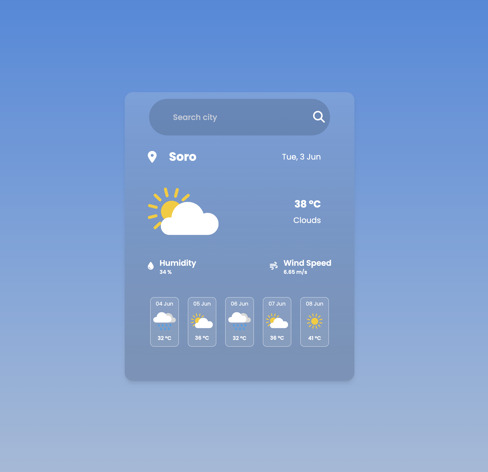

# Weather App

A simple weather application that allows users to search for a city and view the current weather conditions and a 5-day forecast. Built with HTML, CSS (TailwindCSS), and JavaScript.

## Features

- Search for any city to get real-time weather data
- Displays temperature, weather condition, humidity, and wind speed
- Shows a 5-day weather forecast with icons
- Responsive and modern glassmorphism UI
- Uses [OpenWeatherMap API](https://openweathermap.org/api)

## 🖼️ Preview



## Project Structure

```
.
├── index.html
├── script.js
├── package.json
├── tailwind.config.js
├── src/
│   └── input.css
├── Public/
│   └── assets/
│       ├── bg.jpg
│       ├── message/
│       │   ├── not-found.png
│       │   └── search-city.png
│       └── weather/
│           ├── atmosphere.svg
│           ├── clear.svg
│           ├── clouds.svg
│           ├── drizzle.svg
│           ├── rain.svg
│           ├── snow.svg
│           └── thunderstorm.svg
└──-README.md
```

## Getting Started

### Prerequisites

- [Node.js](https://nodejs.org/)
- [npm](https://www.npmjs.com/)

### Installation

1. Clone the repository:
    ```sh
    git clone https://github.com/sandip234-ui/Weather-App.git
    cd "Weather App"
    ```

2. Install dependencies:
    ```sh
    npm install
    ```

3. Build Tailwind CSS (development mode):
    ```sh
    npm run dev
    ```
    This will generate `dist/output.css` from `src/input.css`.

4. Open `index.html` in your browser.

## Configuration

- The OpenWeatherMap API key is set in [`script.js`](script.js) as `apiKey`. Replace it with your own API key if needed.

### Customization
- Icons and background images: `Public/assets/`
- Fonts: Google Fonts in `index.html`
- Tailwind config: `tailwind.config.js`

## 🧠 Credits
- Weather Data: [OpenWeatherMap](https://openweathermap.org/)
- Icons: [FontAwesome](https://fontawesome.com/)
- UI Style: Glassmorphism

## License

This project is licensed under the ISC License.

---

**Made with ❤️ using TailwindCSS and OpenWeatherMap API**